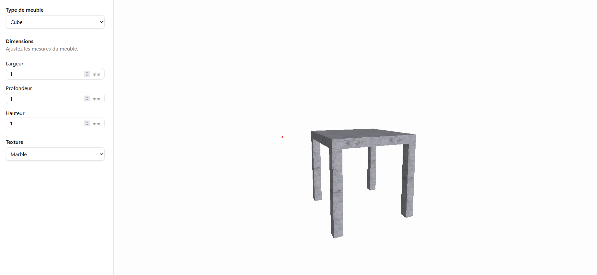

# Configurateur React

Réécriture configurateur 3D (vanilla JS + jQuery + Three.js) en React, dans un but de remise a niveau: comprendre la structure du projet original en reconstruisant ses mécanismes un par un, avec des outils modernes (React, Zustand, Vite).

## Stack

- **React 19** + **Vite** — UI et outillage de dev
- **Three.js** — moteur 3D
- **Zustand** — état partagé entre l'UI et la scène 3D
- **Tailwind CSS** + **shadcn/ui** — composants d'interface

## Aperçu



## Démarrer

```bash
npm install
npm run dev
```

Build de production (utile pour vérifier un comportement qui diffère du mode dev, ex. React StrictMode) :

```bash
npm run build
npm run preview
```

## Structure du projet

```
src/
  Viewer3D.jsx              # Composant unique qui gère Three.js (scène, caméra, renderer, boucle de rendu)
  store/
    useFurnitureStore.js    # État global (dimensions, couleur, texture, type de meuble)
  furniture/
    createTable.jsx         # Construction/redimensionnement d'une table (plateau + 4 pieds)
    Panel.js                # Classe réutilisable : géométrie + matériau(x) + mesh + resize + texture
    textureLoader.js         # Chargement/cache des textures PBR (ambientCG) + calcul du repeat par surface
    textures.js               # Catalogue des textures disponibles
  panels/
    DimensionPanel.jsx       # Panneau UI (dimensions, couleur, type)
  components/ui/             # Composants shadcn/ui (Input, Label, Button)
```

## État actuel

- Scène Three.js montée dans un composant React (`useRef` + `useEffect`), avec `OrbitControls` et redimensionnement automatique du canvas (`ResizeObserver`).
- Dimensions (largeur/hauteur/profondeur) texture pilotées depuis un store Zustand, appliquées en temps réel à la scène.
- Table assemblée à partir de plusieurs pièces (`THREE.Group`), chacune retrouvable via `getObjectByName`.
- Textures PBR (color/normal/roughness) chargées depuis ambientCG, avec un `repeat` calculé séparément par surface (face du plateau, tranches, pieds) pour éviter l'étirement.
- Classe `Panel` en cours d'intégration pour factoriser la création répétitive de chaque pièce (géométrie + matériau + mesh + nom + position + resize).

## Prochaines étapes

1. Finir de brancher `Panel` dans `createTable`/`updateTable` (y compris la question de comment `updateTable` retrouve une instance `Panel`, pas juste un mesh brut, via `getObjectByName`).
2. Étendre à d'autres types de meubles.
3. Ambition finale : comprendre puis porter le vrai moteur du projet original (`objclass/BaseElement.js`, `panel.js`, `zone.js`, `constantes.js`) une fois les bases suffisamment solides.

## Notes d'apprentissage

- Le double-montage de `React.StrictMode` en dev peut interrompre le chargement d'images volumineuses (texture PBR) — comportement dev-only, absent en production (`npm run build && npm run preview`).
- `THREE.Mesh` accepte un tableau de matériaux (un par face de `BoxGeometry`, ordre `[+x, -x, +y, -y, +z, -z]`) — utile pour donner une texture différente aux tranches d'un panneau.
- Un objet dont le `repeat` de texture est mal calculé par rapport à ses proportions réelles paraît étiré — c'est pour ça que le projet original sépare texture de face et couleur de chant (`COLOR_CHANT`).

## Licence

[MIT](LICENSE) 
